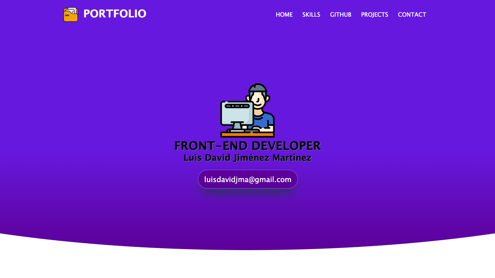

# Luis David Portfolio

## Table of contents

- [Overview](#overview)
  - [The challenge](#the-challenge)
  - [Screenshot](#screenshot)
- [My process](#my-process)
  - [Built with](#built-with)
  - [What I learned](#what-i-learned)
  - [Continued development](#continued-development)
- [Author](#author)

## Overview

### The challenge

Users should be able to:

- View the optimal layout for the site depending on their device's screen size
- See a complete and functional portfolio
- See a sections of skills with diplomas and certifications
- See a section of projects filmed by different technologies
- A fully functional contact form

### Screenshot

## My process

### Built with

- HTML
- CSS
- CSS Flexbox
- JavaScript
- jQuery library

### What I learned

In this project I made a complete portfolio about my experience and my skills, applying CSS transitions and animations and integrating javascript instructions to filter the projects by categories and to make a functional form.

### Continued development

Implementar algunas animaciones más para que sea más atractivo para los usuarios y seguir incluyendo nuevos proyectos realizados y habilidades obtenidas.

## Author

Luis David Jimenez Martinez
- Portfolio - [www.luisdavidjm.com](https://www.luisdavidjm.com)
- GitHub - [LuisDavidJM](https://github.com/LuisDavidJM)
